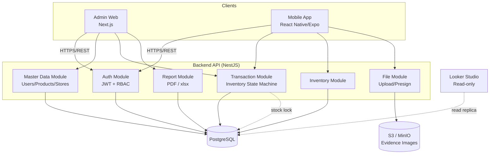
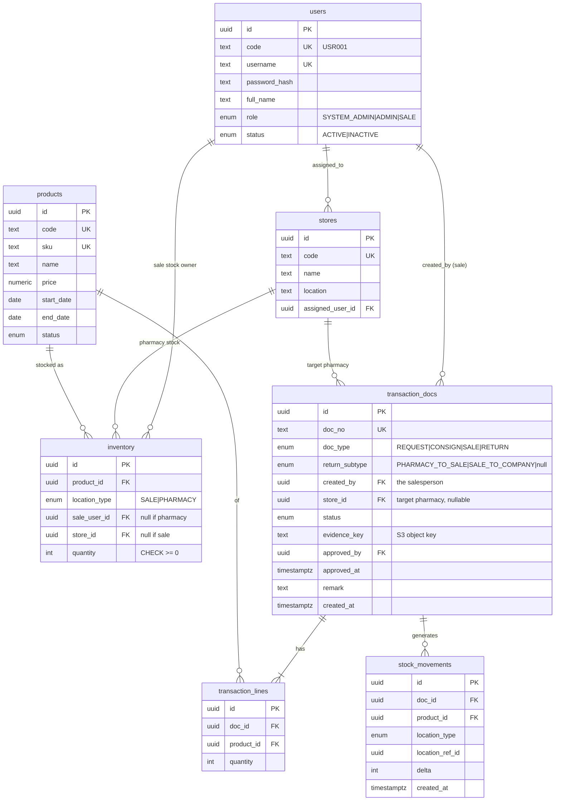
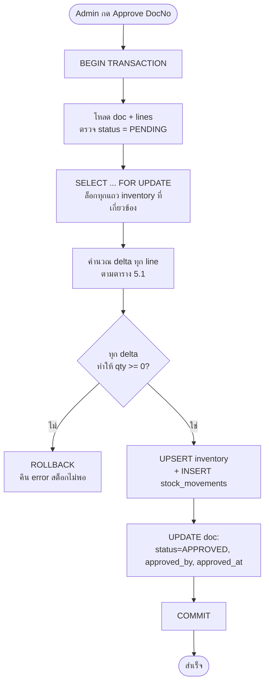

# สถาปัตยกรรมระบบ OTC Consignment (PostgreSQL + Next.js + React Native)

> เอกสารออกแบบสถาปัตยกรรมสำหรับสร้างระบบใหม่ แทนที่ระบบเดิมบน Google Apps Script + Google Sheets
> อ้างอิงจาก `System_Specification.md`, `requirements.txt`, และ business logic จริงในโค้ด `admin/Code.gs` / `mobile/Code.gs`
>
> จัดทำ: 2026-07-16 · องค์กร: Nutrition Profess Pub Co., Ltd.

---

## 1. สรุปการตัดสินใจด้านเทคโนโลยี (Tech Stack)

| ชั้น (Layer) | เทคโนโลยีที่เลือก | เหตุผล |
|---|---|---|
| **Database** | PostgreSQL 16 | Relational, transaction จริง (ACID), row-locking สำหรับคุมสต็อก, พร้อมต่อ Looker Studio/BI |
| **ORM / Migration** | Drizzle ORM + drizzle-kit | SQL-close เขียน `SELECT ... FOR UPDATE` ได้ตรง ๆ (สำคัญมากกับ inventory concurrency), TypeScript type-safe, migration ชัดเจน |
| **Backend API** | NestJS (Node.js + TypeScript) | โครงสร้างชัด (module/service/guard), แชร์ TypeScript กับ frontend, ecosystem ครบ (auth, validation, queue) |
| **Admin Web** | Next.js 15 (App Router) + TypeScript | ตามที่เลือก — จัดการ Master Data ซับซ้อน, สร้าง PDF, import/export xlsx |
| **Mobile App** | React Native (Expo) | ตามที่เลือก — native camera สำหรับถ่ายสลิป, offline-friendly, row-level security |
| **Shared code** | packages/shared (Zod + TS types + enums) | Single source of truth ของ schema/validation ใช้ร่วมทั้ง 3 apps |
| **File Storage** | S3-compatible (MinIO dev / Cloudflare R2 หรือ AWS S3 prod) | แทน Google Drive สำหรับเก็บรูปสลิปหลักฐาน |
| **Auth** | JWT (access + refresh) + Argon2id password hashing | แทนการเก็บรหัสผ่าน plaintext ในชีท (ข้อบกพร่องด้านความปลอดภัยของระบบเดิม) |
| **PDF Generation** | Puppeteer + HTML template (ฟอนต์ Sarabun) | รองรับภาษาไทยเต็มรูปแบบ, ออกสลิปให้ ERP Bplus |
| **Excel Import/Export** | ExcelJS | อ่าน/เขียน .xlsx สำหรับ Master Data |
| **Infra (dev)** | Docker Compose (Postgres + MinIO + API) | สภาพแวดล้อมพัฒนาเหมือนกันทั้งทีม |
| **Monorepo** | pnpm workspaces + Turborepo | จัดการหลาย app + shared package, build cache |

> **ทางเลือกที่พิจารณาแล้วไม่เลือก:** Prisma (velocity ดีแต่ทำ row-lock `FOR UPDATE` ต้องเขียน raw query), Supabase/PostgREST (เร็วแต่ business logic แบบ State Machine + Rollback ควบคุมยากกว่าเมื่ออยู่ใน SQL ล้วน) — ทั้งคู่ยังเปลี่ยนมาใช้ได้ภายหลังเพราะ DB เป็น PostgreSQL มาตรฐาน

---

## 2. ภาพรวมสถาปัตยกรรม (System Architecture)



**หลักการสำคัญ:**
- **Backend เดียว** ให้บริการทั้ง Admin Web และ Mobile (แยก endpoint/permission ด้วย RBAC + row-level filtering) — ต่างจากระบบเดิมที่มี 2 Apps Script deployment แยกกัน
- **ทุกการเปลี่ยนสต็อกเกิดที่ backend เท่านั้น** ผ่าน DB transaction — client ไม่มีทางแก้สต็อกตรง ๆ
- **สต็อก 2 ระดับ** (Sale / Pharmacy) เป็นหัวใจ — ควบคุมด้วย State Machine + row lock

---

## 3. โครงสร้าง Monorepo

```
otc-consignment/
├── apps/
│   ├── api/                    # NestJS backend
│   │   ├── src/
│   │   │   ├── auth/           # login, JWT, guards, RBAC
│   │   │   ├── users/          # tb_users CRUD
│   │   │   ├── products/       # tb_products CRUD + import
│   │   │   ├── stores/         # tb_stores CRUD + transfer owner
│   │   │   ├── inventory/      # query สต็อก + adjustStock (internal)
│   │   │   ├── transactions/   # submit / approve / reject / cancel(rollback)
│   │   │   │   └── state-machine.ts   # ★ หัวใจ: Inventory State Machine
│   │   │   ├── files/          # presigned upload, evidence
│   │   │   ├── reports/        # PDF (Puppeteer), xlsx export
│   │   │   └── common/         # filters, interceptors, pagination
│   │   └── test/               # e2e tests (สำคัญมากสำหรับ state machine)
│   ├── admin/                  # Next.js 15 admin web
│   └── mobile/                 # React Native (Expo) sale app
├── packages/
│   ├── db/                     # Drizzle schema + migrations + seed
│   │   ├── schema/
│   │   └── migrations/
│   ├── shared/                 # Zod schemas, TS types, enums, constants
│   └── config/                 # eslint/tsconfig ร่วม
├── docker-compose.yml          # postgres + minio (+ api ตอน dev)
├── turbo.json
└── pnpm-workspace.yaml
```

---

## 4. โครงสร้างฐานข้อมูล (PostgreSQL Schema)

### 4.1 หลักการออกแบบ (ปรับปรุงจาก Google Sheet เดิม)

| ประเด็นในระบบเดิม | ปัญหา | การออกแบบใหม่ใน PostgreSQL |
|---|---|---|
| ID เป็น string เช่น `USR001` | ชนกันเองได้, race ตอน gen ID | ใช้ **UUID เป็น PK** + คอลัมน์ `code` แบบอ่านง่าย (unique) สำหรับแสดงผล |
| `LocationID` polymorphic (เก็บ UserID หรือ StoreID) | ไม่มี FK, integrity หลุด | แยกเป็น `sale_user_id` / `store_id` (nullable) + `CHECK` constraint |
| Password plaintext | ไม่ปลอดภัย | เก็บ **Argon2id hash** เท่านั้น |
| 1 transaction = หลาย row แบน ๆ ใน sheet | ข้อมูลซ้ำต่อ line | แยก **header (`transaction_docs`) + lines (`transaction_lines`)** |
| Status `Cansaleed` (typo) | สื่อสารพลาด | ใช้ enum มาตรฐาน `PENDING/APPROVED/REJECTED/CANCELLED` |
| ไม่มี audit ว่าใครแก้สต็อกเมื่อไหร่ | ตรวจสอบย้อนหลังไม่ได้ | เพิ่มตาราง append-only `stock_movements` (ledger) |
| Enum เป็น string อิสระ | สะกดผิดได้ | ใช้ **PostgreSQL native enum** |

### 4.2 ER Diagram



### 4.3 DDL หลัก (สรุป — เขียนจริงด้วย Drizzle)

```sql
-- ENUM types
CREATE TYPE user_role     AS ENUM ('SYSTEM_ADMIN', 'ADMIN', 'SALE');
CREATE TYPE record_status AS ENUM ('ACTIVE', 'INACTIVE');
CREATE TYPE location_type AS ENUM ('SALE', 'PHARMACY');
CREATE TYPE doc_type      AS ENUM ('REQUEST', 'CONSIGN', 'SALE', 'RETURN');
CREATE TYPE return_subtype AS ENUM ('PHARMACY_TO_SALE', 'SALE_TO_COMPANY');
CREATE TYPE txn_status    AS ENUM ('PENDING', 'APPROVED', 'REJECTED', 'CANCELLED');

-- inventory: คีย์คู่ (product + location) — บังคับความถูกต้องด้วย CHECK + partial unique index
CREATE TABLE inventory (
  id            uuid PRIMARY KEY DEFAULT gen_random_uuid(),
  product_id    uuid NOT NULL REFERENCES products(id),
  location_type location_type NOT NULL,
  sale_user_id  uuid REFERENCES users(id),
  store_id      uuid REFERENCES stores(id),
  quantity      integer NOT NULL DEFAULT 0 CHECK (quantity >= 0),
  updated_at    timestamptz NOT NULL DEFAULT now(),
  CONSTRAINT loc_consistency CHECK (
    (location_type = 'SALE'     AND sale_user_id IS NOT NULL AND store_id IS NULL) OR
    (location_type = 'PHARMACY' AND store_id     IS NOT NULL AND sale_user_id IS NULL)
  )
);
CREATE UNIQUE INDEX uq_inv_sale     ON inventory(product_id, sale_user_id) WHERE location_type = 'SALE';
CREATE UNIQUE INDEX uq_inv_pharmacy ON inventory(product_id, store_id)     WHERE location_type = 'PHARMACY';
```

> **หมายเหตุการทำให้เป็นมาตรฐาน:** ในระบบเดิม `LocationID` สลับความหมายไปมา (REQUEST/Sale_to_Company เก็บ UserID, CONSIGN/SALE เก็บ StoreID) การออกแบบใหม่ให้ **`created_by` = พนักงานขายเสมอ** และ **`store_id` = ร้านยาที่เกี่ยวข้อง (ถ้ามี)** ทำให้ตรรกะ State Machine อ่านง่ายและ integrity แน่นหนา

---

## 5. Inventory State Machine (หัวใจของระบบ) ⭐

ทุกการเปลี่ยนสต็อกเกิด **เฉพาะตอน Admin กด Approve** และต้องทำใน **DB transaction เดียว** พร้อม **row lock** เพื่อกันสต็อกติดลบจากการอนุมัติพร้อมกัน

### 5.1 ตารางการเปลี่ยนสถานะสต็อก (On Approve)

| DocType | ReturnSubtype | ผลต่อสต็อก (เมื่ออนุมัติ) | เงื่อนไข (Guard) | ต้องแนบสลิป |
|---|---|---|---|---|
| `REQUEST` (เบิก) | — | Sale(`created_by`) **+qty** | จากบริษัท (ไม่จำกัด) | ไม่ |
| `CONSIGN` (ฝากขาย) | — | Sale(`created_by`) **−qty** → Pharmacy(`store`) **+qty** | Sale stock ≥ qty | ไม่ |
| `SALE` (ขายจริง) | — | Pharmacy(`store`) **−qty** | Pharmacy stock ≥ qty | **ใช่** |
| `RETURN` | `PHARMACY_TO_SALE` | Pharmacy(`store`) **−qty** → Sale(`created_by`) **+qty** | Pharmacy stock ≥ qty | (แล้วแต่นโยบาย) |
| `RETURN` | `SALE_TO_COMPANY` | Sale(`created_by`) **−qty** | Sale stock ≥ qty | (แล้วแต่นโยบาย) |

### 5.2 การ Rollback (เมื่อ Cancel รายการที่ Approved แล้ว)

ทำ operation **ตรงกันข้าม** ของตาราง 5.1 และต้อง guard ว่า inverse ไม่ทำให้สต็อกใด ๆ ติดลบ (เช่น ถ้าของถูกขายต่อไปแล้ว จะ rollback การ consign ไม่ได้ — ต้องแจ้ง error)

### 5.3 Flow การอนุมัติ (พร้อม concurrency safety)



### 5.4 Pseudocode (NestJS + Drizzle)

```typescript
// transactions/state-machine.ts
async approve(docNo: string, adminId: string) {
  return this.db.transaction(async (tx) => {
    const doc = await tx.query.transactionDocs.findFirst({
      where: eq(docs.docNo, docNo), with: { lines: true },
    });
    if (!doc)               throw new NotFoundException(docNo);
    if (doc.status !== 'PENDING')
                            throw new ConflictException('ไม่ใช่รายการรออนุมัติ');

    // 1) รวม delta ต่อ (location, product) จากทุก line
    const deltas = this.computeDeltas(doc);           // ตามตาราง 5.1

    // 2) ล็อกแถว inventory ที่เกี่ยวข้อง (กัน race)
    for (const d of deltas) {
      const [inv] = await tx.select().from(inventory)
        .where(locFilter(d)).for('update');           // SELECT ... FOR UPDATE
      const current = inv?.quantity ?? 0;
      if (current + d.delta < 0)
        throw new BadRequestException(`สต็อกไม่พอ: ${d.label}`);
    }

    // 3) เขียนจริง (upsert) + บันทึก ledger
    for (const d of deltas) {
      await this.upsertInventory(tx, d);
      await tx.insert(stockMovements).values({ docId: doc.id, ...d });
    }

    // 4) ปิดงาน
    await tx.update(docs)
      .set({ status: 'APPROVED', approvedBy: adminId, approvedAt: new Date() })
      .where(eq(docs.id, doc.id));

    return { docNo, status: 'APPROVED' };
  });                                                 // COMMIT / auto-ROLLBACK on throw
}
```

> จุดต่างสำคัญจากระบบเดิม: ระบบเดิมทำ "dry-run" แล้วค่อยเขียน (มี race window) — เวอร์ชันใหม่ใช้ **`SELECT ... FOR UPDATE` ภายใน transaction** ทำให้ atomic จริง ไม่เกิดสต็อกติดลบแม้อนุมัติพร้อมกัน

---

## 6. Auth & Row-Level Security

- **Login:** username + password → ตรวจ Argon2id hash → ออก JWT (access ~15 นาที + refresh ~7 วัน)
- **RBAC (Role-based):**
  - `SYSTEM_ADMIN` / `ADMIN` → Admin Web ทั้งหมด (อนุมัติ, master data, report)
  - `SALE` → Mobile เท่านั้น
- **Row-Level Security (สำหรับ SALE):** ทุก query ของ sale ถูกกรองที่ service layer
  - Sale stock: เห็นเฉพาะ `sale_user_id = ตัวเอง`
  - Pharmacy stock / stores: เห็นเฉพาะร้านที่ `stores.assigned_user_id = ตัวเอง`
  - สร้าง transaction: `created_by` ถูก set จาก JWT เสมอ (client ปลอมไม่ได้)
- บังคับที่ backend (guard + query filter) — ไม่พึ่ง client

---

## 7. REST API (ร่าง endpoint หลัก)

| Method | Path | Role | หน้าที่ |
|---|---|---|---|
| POST | `/auth/login` | public | ล็อกอิน คืน JWT |
| POST | `/auth/refresh` | public | ต่ออายุ token |
| GET | `/dashboard/stats` | admin | นับ pending, สต็อกรวม, จำนวน sale, แจ้งเตือนหมดอายุ |
| GET | `/transactions?status=PENDING` | admin | ดึงรายการรออนุมัติ (join ชื่อ) |
| POST | `/transactions` | sale | ส่งรายการใหม่ (หลาย line) → PENDING |
| POST | `/transactions/:docNo/approve` | admin | อนุมัติ + รัน state machine |
| POST | `/transactions/:docNo/reject` | admin | ปฏิเสธ (ไม่แตะสต็อก) + remark |
| POST | `/transactions/:docNo/cancel` | admin | ยกเลิก + rollback (ถ้า approved แล้ว) |
| POST | `/transactions/bulk-approve` | admin | อนุมัติหลายใบ |
| GET | `/inventory?type=SALE\|PHARMACY` | admin/sale | ดูสต็อก (sale ถูกกรอง row-level) |
| GET/POST/PATCH | `/products` `/stores` `/users` | admin | CRUD master data |
| POST | `/stores/:id/transfer` | admin | โอนร้านให้ sale คนใหม่ |
| POST | `/products/import` `/stores/import` | admin | import xlsx (validate ซ้ำ) |
| POST | `/files/presign` | sale | ขอ presigned URL อัปโหลดสลิป → S3 |
| GET | `/reports/transactions/:docNo/pdf` | admin | ออกสลิป PDF (Bplus) |
| GET | `/reports/export.xlsx` | admin | export ข้อมูล |

---

## 8. ฟีเจอร์เฉพาะที่ต้องออกแบบเพิ่ม

- **รูปหลักฐาน (Evidence):** Mobile ขอ `presigned URL` แล้วอัปโหลดตรงเข้า S3/MinIO (ไม่ผ่าน backend เพื่อลดภาระ) → เก็บ `evidence_key` ใน `transaction_docs` → Admin ดูผ่าน presigned GET
- **PDF สลิป (ERP Bplus):** Puppeteer render HTML template + ฟอนต์ Sarabun → คุมเลย์เอาต์/ภาษาไทยได้แม่นยำ
- **Import/Export .xlsx:** ExcelJS + Zod validate + กันซ้ำด้วย unique constraint ที่ DB (SKU, code, username)
- **แจ้งเตือนสินค้าหมดอายุ:** query `end_date` ภายใน N วัน (ระบบเดิมใช้ 14 วัน) — แสดงบน dashboard
- **โอนย้ายร้าน (Store transfer):** อัปเดต `assigned_user_id` → สิทธิ์การเห็นย้ายทันที (สต็อก pharmacy ผูกกับร้าน ไม่ใช่ตัว sale จึงไม่ต้องย้ายสต็อก)

---

## 9. แผนการพัฒนาแบบเป็นเฟส (Roadmap)

| เฟส | ขอบเขต | ผลลัพธ์ |
|---|---|---|
| **0. Setup** | Monorepo, Docker Compose (Postgres+MinIO), CI, lint/format | รันสภาพแวดล้อม dev ได้ |
| **1. Data layer** | Drizzle schema ครบ 5+2 ตาราง, migration, seed (admin เริ่มต้น) | DB พร้อมใช้ + type-safe |
| **2. Auth** | login/JWT/RBAC/refresh, password hashing | ล็อกอินแยก role ได้ |
| **3. Master Data** | CRUD users/products/stores + import/export + transfer | Admin จัดการข้อมูลหลักได้ |
| **4. State Machine** ⭐ | submit/approve/reject/cancel + rollback + **e2e tests** | หัวใจระบบ + ทดสอบครบทุกเส้นทาง |
| **5. Inventory & Dashboard** | query สต็อก 2 ระดับ + row-level + สถิติ dashboard | มองเห็นสต็อกถูกต้อง |
| **6. Admin Web** | Next.js: approval, master data, inventory, PDF | แอดมินใช้งานจริงได้ |
| **7. Mobile App** | Expo: login, สต็อกตนเอง, submit + ถ่ายสลิป, return | เซลล์ใช้งานจริงได้ |
| **8. Reports & Polish** | PDF Bplus, xlsx export, Looker Studio, hardening | ส่งมอบ |

> **แนะนำ:** ลงทุนกับ **เฟส 4 (State Machine) + e2e test** ให้หนักที่สุด เพราะเป็นจุดที่ระบบเดิมมีความเสี่ยง (race condition, สต็อกติดลบ, rollback ผิด) และเป็นแกนความถูกต้องทางบัญชีสต็อกของทั้งธุรกิจ

---

## 10. ข้อสังเกต/ความเสี่ยงจากระบบเดิม ที่ต้องแก้ในระบบใหม่

1. **Password plaintext** ในชีท → เปลี่ยนเป็น hash
2. **Race condition** ตอน gen ID และตอน approve พร้อมกัน → UUID + `FOR UPDATE`
3. **`LocationID` polymorphic** ไม่มี FK → แยกคอลัมน์ + CHECK
4. **สถานะ `Cansaleed`** (typo จาก find-replace `Cancel`→`Cansale`) และ **`DocType` ไม่ตรงกันระหว่างสเปกกับโค้ด** (`Request` vs `Restock`) → กำหนด enum มาตรฐานชุดเดียว
5. **ความหมาย `LocationID` สลับไปมา** ตาม DocType → normalize เป็น `created_by` + `store_id`
6. **ไม่มี audit trail การเคลื่อนสต็อก** → เพิ่ม `stock_movements` (append-only ledger)
7. เอกสาร 3 ฉบับ schema ไม่ตรงกัน → เอกสารนี้เป็น **source of truth ใหม่**

---

## ภาคผนวก: การแมป Enum เดิม → ใหม่

| ระบบเดิม (โค้ด/สเปก) | มาตรฐานใหม่ |
|---|---|
| `Restock` / `Request` | `REQUEST` |
| `Consign` | `CONSIGN` |
| `Sale` (DocType) | `SALE` |
| `Return` | `RETURN` |
| `Sale_Stock` / `Sale` | `SALE` (location_type) |
| `Pharmacy_Stock` / `Pharmacy` | `PHARMACY` (location_type) |
| `Pending/Approved/Cansaleed/Rejected` | `PENDING/APPROVED/CANCELLED/REJECTED` |
| Role `OTC_Sale` / `Sale` | `SALE` |
